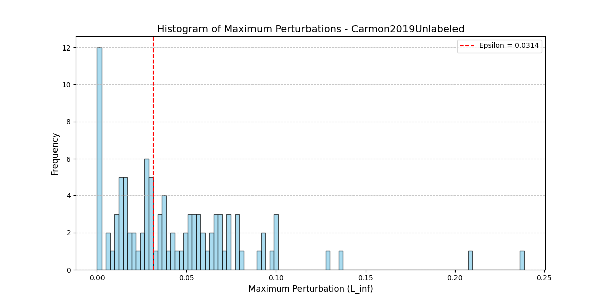
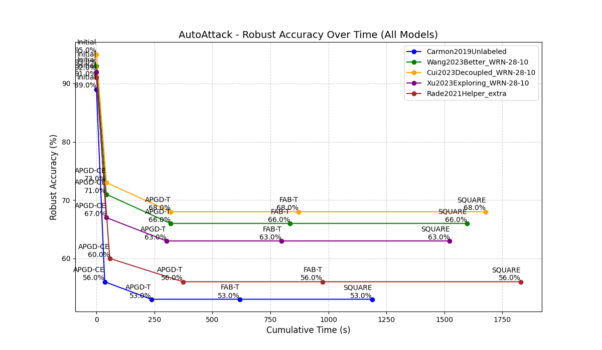
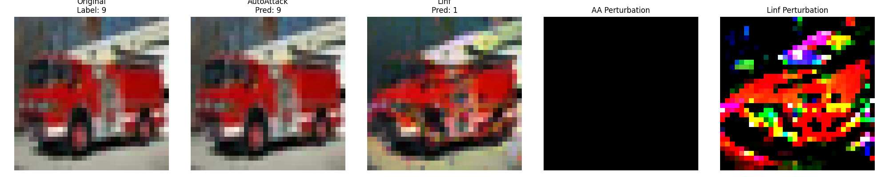
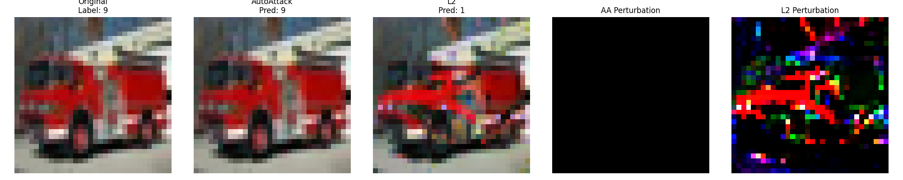
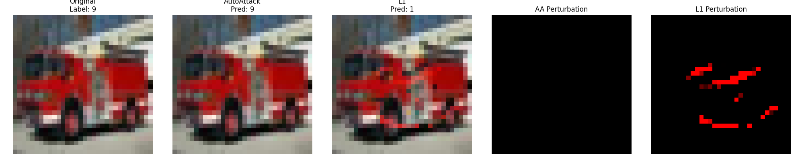
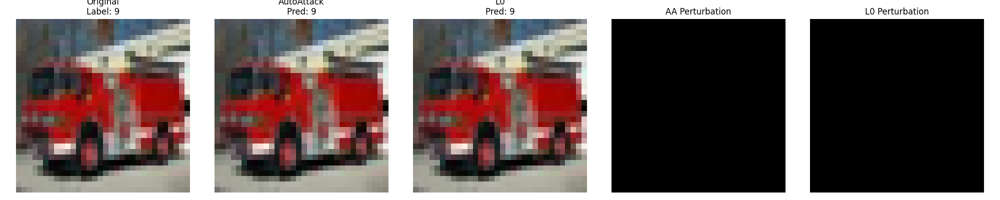

# Robustness Evaluation of RobustBench Models using AutoAttack and FMN

:video_game: For a quick demo example for the first model, check out [this notebook](https://colab.research.google.com/drive/10-8Gly0O00YIGzpie1V-1Vaxfg1gRONL?usp=drive_link).

:pencil: For a complete evaluation of all five models, check out the code and the results provided in this repository.

## Overview

This project compares the robustness of 5 models from RobustBench when attacked using:
- **AutoAttack**: The standard benchmark attack suite.
- **FMN**: A fast and effective minimum-norm adversarial attack.

---

## Models 

| Model | Description | Paper Link |
|-------|-------------|------------|
| Carmon2019Unlabeled | Unlabeled data improves adversarial robustness by leveraging semi-supervised learning (TRADES + pseudo-labels) | [Unlabeled Data Improves Adversarial Robusntess](https://arxiv.org/abs/1905.13736) |
| Wang2023Better | Proposes improved loss landscape shaping for better robust generalization | [Better Diffusion Models Further Improve Adversarial Training](https://arxiv.org/abs/2302.04638) |
| Cui2023Decoupled | Introduces Decoupled Sharpness-Aware Minimization (DSAM) to reduce sharpness and improve adversarial robustness | [Decoupled Kullback-Leibler Divergence Loss](https://arxiv.org/abs/2305.13948) |
| Xu2023Exploring | Explores flatness and sharpness in the loss landscape to enhance model robustness | [Exploring and Exploiting Decision Boundary Dynamics for Adversarial Robustness](https://arxiv.org/abs/2302.03015) |
| Rade2021Helper | Leverages helper models to guide robust training and achieve better certified and empirical robustness | [Helper-based Adversarial Training: Reducing Excessive Margin to Achieve a Better Accuracy vs. Robustness Trade-off](https://openreview.net/forum?id=BuD2LmNaU3a) |

---

## Dataset

**CIFAR-10**, tested on the **first 100 validation samples**.

---

## Attacks Comparison

In this project, we compare two strong adversarial attacks widely used in adversarial robustness evaluation:

### ✅ AutoAttack

AutoAttack is a **reliable robustness benchmark** based on an ensemble of four attacks:

- **APGD-CE**: Maximizes the cross-entropy loss.
- **APGD-DLR**: Maximizes the DLR loss, often more effective against robust models.
- **FAB**: Finds boundary-crossing adversarial examples with **minimum ℓp-norm**.
- **Square Attack**: A **black-box** attack based on random square perturbations.

AutoAttack works under a **fixed ε constraint** and systematically explores different adversarial directions. It is considered the gold standard for evaluating robustness in RobustBench.

---

### ✅ Fast Minimum-Norm (FMN) Attack

FMN is an efficient gradient-based attack that **directly searches for the minimal perturbation** able to fool the model:

- FMN focuses on finding the **closest boundary-crossing adversarial sample**, minimizing the perturbation norm.
- Can operate:
    - In a **bounded** way (e.g., ε = 8/255).
    - Or **unbounded**, searching for the closest adversarial even outside the usual ε constraint.
- Faster than AutoAttack and effective when computing minimal-norm adversarial examples.

---

### Comparison

| Aspect | AutoAttack | FMN |
|--------|------------|-----|
| Composition | Ensemble of 4 attacks | Single attack |
| Goal | Explore multiple adversarial objectives | Find the closest misclassified sample |
| Perturbation | Always inside ε-ball | Can be bounded or unbounded |
| Behavior | Maximizes loss within ε | Minimizes perturbation norm |
| Speed | Slower | Faster |
| Robustness Scores | RobustBench Standard | Comparable when ε-bounded |

---

### Results

Here are the results obtained by testing autoatack with the Linf norm and fmn on all norms with 100 samples.

| Model | standard accuracy | AutoAttack | FMN Linf | FMN Linf ε=8/255 | FMN L2 | FMN L1 | FMN L0 |
|-------|-------------------|------------|----------|------------------|--------|--------|--------|
| Carmon2019Unlabeled | 89% | 53% | 0% | 46% | 0% | 0% | 21% |
| Wang2023Better | 93% | 66% | 0% | 33% | 0% | 0% | 27% | 
| Cui2023Decoupled | 95% | 68% | 0% | 32% | 0% | 0% | 24% | 
| Xu2023Exploring | 92% | 63% | 0% | 30% | 0% | 0% | 31% | 
| Rade2021Helper | 91% | 56% | 0% | 41% | 0% | 0% | 18% | 

The unbounded epsilon version of FMN recorded 0% accuracy on all norms except for L0, outperforming AutoAttack.
To compare FMN with AutoAttack in a better way, we counted how many samples had points with a maximum perturbation less than the epsilon used by AutoAttack (ε = 8/255) and plotted the results.

This is an example for the Carmon2019Unlabeled:

 

This table shows the execution times of all attacks. 

AutoAttack is significantly slower than FMN, and as can be seen from the following graph, after the second step of the attack (APGD-T), it can no longer find new adversarial examples.

| Model | AutoAttack(s) | FMN Linf(s) | FMN L2(s) | FMN L1(s) | FMN L0 (s) |
|-------|---------------|-------------|-----------|-----------|------------|
| Carmon2019Unlabeled | 1188.20 | 51.45 | 51.91 | 51.81 | 51.94 |
| Wang2023Better | 1597.80 | 59.22 | 59.27 | 59.05 | 59.24 |
| Cui2023Decoupled | 1678.40 | 58.94 | 59.29 | 59.05 | 59.24 |
| Xu2023Exploring | 1523.00 | 59.10 | 59.06 | 59.28 | 59.72 |
| Rade2021Helper | 1828.60 | 77.91 | 78.28 | 78.20 | 78.58 |

 

Here we can see an example of adversarial example produced with autoattack and fmn and the perturbations applied by both attacks.

In this case, Autoattack has not been able to find an adversarial example, while fmn does, but by applying a perturbation that completely distorts the original image.

All other examples are saved in the results folder of this repository.

All attacks over each model were evaluated on Google Colab using their t4 GPU.
